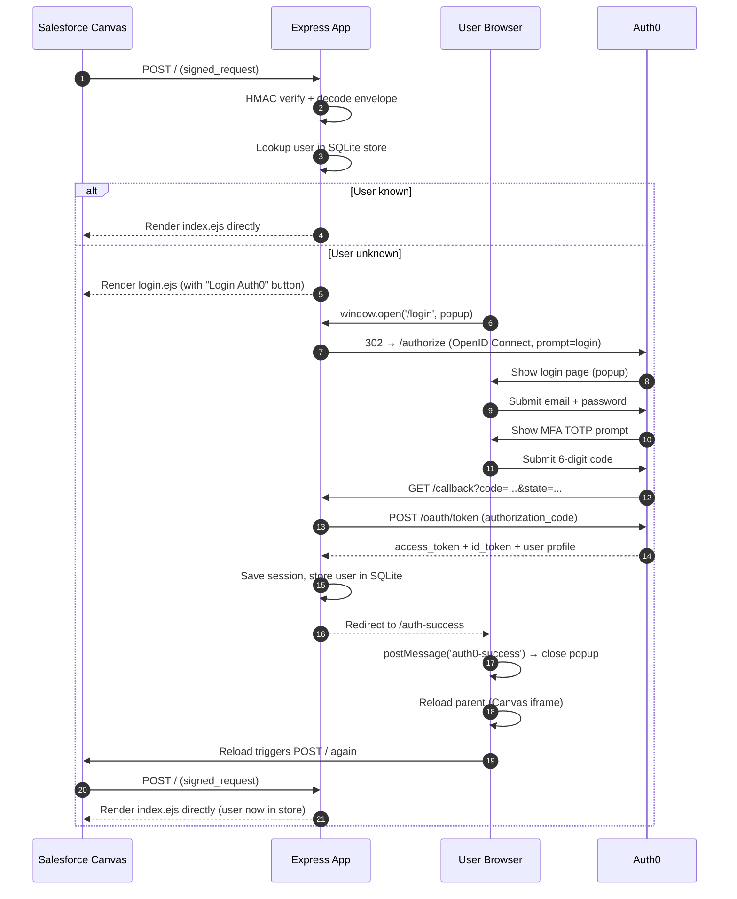
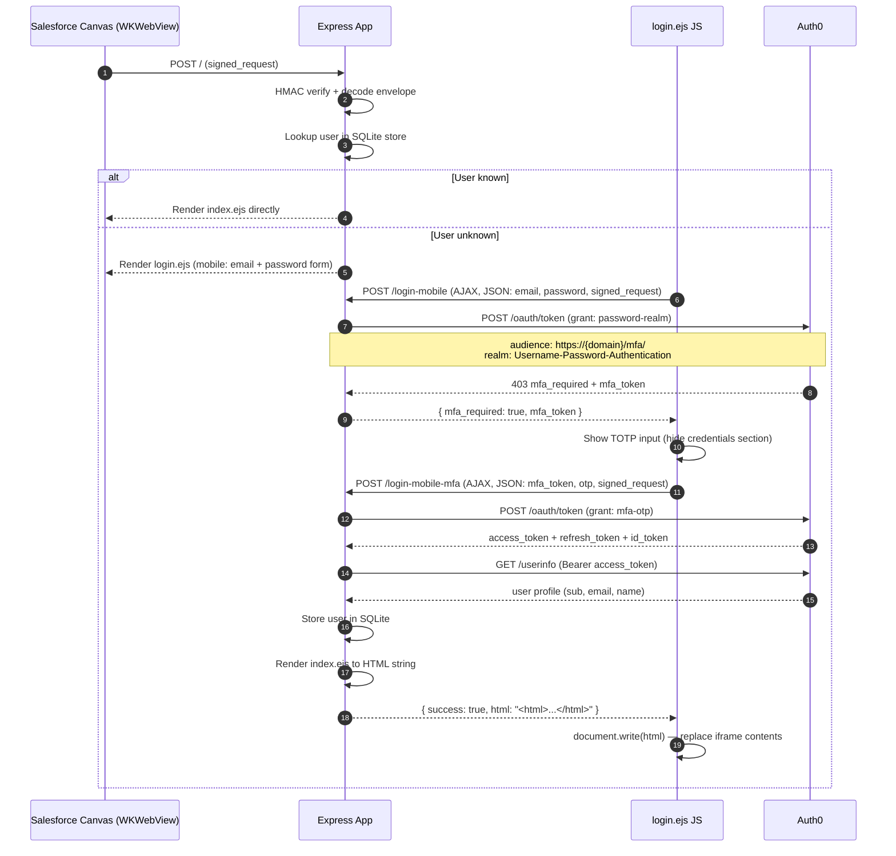

# Salesforce Canvas Demo with OAuth

Node.js app showcasing Salesforce Canvas integration with Auth0 OAuth authentication, supporting both desktop (browser popup) and mobile (Salesforce Mobile / WKWebView) flows.

---

## Overview

This app is embedded inside Salesforce as a Canvas app. Salesforce sends a signed `signed_request` payload to the app via HTTP POST. The app validates the [HMAC](https://en.wikipedia.org/wiki/HMAC) (sometimes expanded as either keyed-hash message authentication code or hash-based message authentication code) signature, decodes the Canvas envelope (which contains the user's identity and Salesforce context), and authenticates the user against Auth0 before rendering the app UI.

The app supports two authentication paths, **both requiring Multi-Factor Authentication (TOTP)**:

- **Desktop**: Auth0 Universal Login opened in a popup window using the OpenID Connect flow with built-in MFA challenge
- **Mobile (Salesforce Mobile)**: Custom in-iframe email/password form using Auth0's `password-realm` and `mfa-otp` grants. The login form, MFA TOTP prompt, and rendered app all stay inside the Salesforce Canvas iframe — no redirects, no popups (which the WKWebView blocks).

---

## Architecture


**Key design constraint**: The Salesforce Canvas `POST /` is issued by Salesforce's infrastructure, not by the user's WKWebView. The `Set-Cookie` response header therefore never reaches the mobile browser's cookie jar. The entire mobile flow is **stateless with respect to session cookies** — all necessary context travels through hidden form fields (`signed_request`) and is re-validated on every request.

**Why custom MFA UI on mobile**: Auth0 sets `X-Frame-Options: DENY` on its hosted login pages, which prevents Auth0 from rendering inside the Salesforce Canvas iframe. The mobile flow therefore uses Auth0's REST API (`/oauth/token` with `password-realm` and `mfa-otp` grants) so that the entire login experience renders directly in the iframe.

---

## Sequence Diagrams

### Desktop (Browser Popup) Flow



### Mobile (Salesforce iOS/Android) Flow



---

## Project Structure

```
├── app.js                  # Express app entry point, Canvas signed_request handler
├── auth0.min.js            # Auth0 JS SDK bundle (served to the browser for the desktop popup login flow)
├── db.js                   # SQLite setup (user email → Auth0 user ID store)
├── lib/
│   ├── canvas.js           # decodeSignedRequest() — HMAC verification + envelope decode
│   └── salesforce.js       # getAccountName() — Salesforce Account API helper
├── routes/
│   ├── auth.js             # Auth routes: /login, /login-mobile, /login-mobile-mfa, /callback, /auth-success, /logout
│   └── index.js            # App routes: GET /, POST /updateAccount
├── views/
│   ├── login.ejs           # Login page (desktop: Auth0 button; mobile: AJAX email/password + TOTP form)
│   ├── index.ejs           # Main app page (account name editor)
│   ├── auth-success.ejs    # Desktop post-login bridge (closes popup, reloads parent)
│   ├── callback.ejs        # Salesforce OAuth callback page
│   └── error.ejs           # Error page
├── var/db/
│   ├── sessions.db         # express-session SQLite store
│   └── store.db            # User email → Auth0 user ID mapping
├── certs/                  # Local HTTPS certificates (development only)
├── .env.example            # Template for all required environment variables
├── AUTH0_SETUP.md          # Step-by-step Auth0 tenant configuration (MFA, grants, connection)
└── test/
    └── test.http           # Manual HTTP test requests (not implemented)
```

---

## Dependencies

| Package | Purpose |
|---|---|
| `express` | HTTP server and routing |
| `passport` + `passport-openidconnect` | Desktop OAuth via Auth0 OpenID Connect |
| `express-session` + `connect-sqlite3` | Session store (desktop flow) |
| `connect-ensure-login` | Login guard middleware — redirects unauthenticated requests |
| `csurf` | CSRF protection (cookie mode) |
| `axios` | Auth0 token exchange and Salesforce API calls |
| `ejs` | Server-side HTML templating |
| `sqlite3` + `mkdirp` | User identity persistence |
| `body-parser` | Request body parsing |
| `cookie-parser` | Cookie parsing (required for CSRF cookie mode) |
| `morgan` | HTTP request logging |
| `dotenv` | Environment variable loading |
| `@salesforce/canvas-js-sdk` | Salesforce Canvas JS SDK (loaded in views for Canvas API access) |
| `base64-url` | Base64url encoding/decoding used in signed_request processing |
| `crypto-js` | HMAC-SHA256 computation for Canvas signature verification |

---

## Environment Configuration

### Prerequisites

1. A Salesforce org with a Connected App configured as a Canvas app
2. An Auth0 tenant with:
   - A **Regular Web Application** (used for both desktop OpenID Connect and mobile MFA grants)
   - **Grant types enabled** on the application: `authorization_code`, `refresh_token`, `password`, `http://auth0.com/oauth/grant-type/password-realm`, `http://auth0.com/oauth/grant-type/mfa-otp`
   - A **Username-Password-Authentication** database connection
   - **Default Directory** set to `Username-Password-Authentication` at the tenant level
   - **Multi-Factor Authentication** enabled with **One-time Password (TOTP)** factor; policy set to **Always**

See [AUTH0_SETUP.md](AUTH0_SETUP.md) for detailed step-by-step Auth0 configuration instructions, including how to enable the password grants via the Management API.

### Local Development

```bash
npm install

# Generate local HTTPS certs (required — Canvas requires HTTPS)
# Place localhost.pem and localhost-key.pem in ./certs/

# Copy the example env file and fill in your values
cp .env.example .env

npm start
```

### Heroku Deployment

Set all environment variables in Heroku Config Vars (Settings → Config Vars) and deploy via the button above or `git push heroku main`.


### Salesforce Configuration

#### Part 1: Create a visualforce **CanvasJS** using the following apex code:
```
<apex:page >
    <apex:canvasApp applicationName="CanvasJS" height="500px" width="500px"/>
</apex:page>
```

Enable the option "Available for Lightning Experience, Experience Builder sites, and the mobile app"


#### Part 2: Create the External Client App: 
---
**Section Policies > App Policies**
- Start Page: `OAuth`
- Selected Profiles: `System Administrator` (only for testing)


**Section Policies > OAuth Policies**
- Permited Users: `Admin approved users are pre-authorized`
- OAuth Start URL: `the-url-where-is-running-the-nodejs-project/callback_sfdc`
---

**Section Settings**

**Fields:**
- External Client App Name: `CanvasJS`
- API Name: `CanvasJS`
- Contact Email: `your email`

**OAuth Settings:**
- Canvas App URL: `the-url-where-is-running-the-nodejs-project/callback_sfdc`

**Selected OAuth Scopes:**
- `Access the identity URL service (id, profile, email, address, phone)`
- `Manage user data via APIs (api)`
- `Full access (full)`
- `Perform requests at any time (refresh_token, offline_access)`
- `Access the Salesforce API Platform (sfap_api)`

**Canvas App Settings:**

- Canvas App URL: `the-url-where-is-running-the-nodejs-project`
- Access Method: `Signed Request (POST)`
- Locations: `Visualforce Page` and `Lightning Component`
---
#### Part 3: Add the visualforce component to the Account page 

- Open the Account record page 
- In the ***Setup Menu*** click on **Edit Page**
- Position the visualforce component on the page

---

## Environment Variables

Copy `.env.example` to `.env` and fill in the values. All variables are required unless a default is noted.

| Variable | Description |
|---|---|
| `CANVAS_CONSUMER_SECRET` | Consumer secret from the Salesforce Connected App — used to verify the `signed_request` HMAC |
| `SALESFORCE_DOMAIN` | Salesforce org instance hostname, e.g. `mycompany.my.salesforce.com` — used to load the Canvas SDK |
| `AUTH0_DOMAIN` | Auth0 tenant domain, e.g. `your-tenant.auth0.com` |
| `AUTH0_CLIENT_ID` | Auth0 application Client ID |
| `AUTH0_CLIENT_SECRET` | Auth0 application Client Secret |
| `AUTH0_CONNECTION` | Auth0 database connection name (default: `Username-Password-Authentication`) |
| `SESSION_SECRET` | Strong random secret for signing session cookies — generate with `node -e "console.log(require('crypto').randomBytes(32).toString('hex'))"` |
| `URL` | Public base URL of this app, e.g. `https://your-app.herokuapp.com` — used to build the OAuth callback URL and `postMessage` origin |
| `PORT` | Port to listen on (set automatically by Heroku) |
| `LOCAL_HTTPS` | Set to `true` to enable the local HTTPS server using certs in `./certs/` |

---

## Security

### Multi-Factor Authentication

Both desktop and mobile flows enforce MFA via TOTP (Google Authenticator / Authy / 1Password / Auth0 Guardian / Microsoft Authenticator) when the Auth0 tenant policy is set to **Always**.

- **Desktop**: Auth0's hosted login page handles enrollment (QR code) and challenge (6-digit code) automatically.
- **Mobile**: Custom UI in [views/login.ejs](views/login.ejs). When Auth0 returns `mfa_required` from the `password-realm` grant, the JavaScript hides the credentials form and shows a TOTP input. The user's code is submitted to `/login-mobile-mfa`, which calls Auth0's `mfa-otp` grant.
- **Enrollment on mobile**: First-login enrollment must be completed once via the desktop flow (or via the user's Auth0 account portal). After that, the same TOTP secret works on both platforms.

### Canvas Signature Verification

Every `POST /` from Salesforce is verified by recomputing the HMAC-SHA256 of the base64-encoded envelope using `CANVAS_CONSUMER_SECRET` and comparing it to the signature prefix in `signed_request`. Requests that fail this check are rejected immediately.

The same verification is applied in `POST /login-mobile`, `POST /login-mobile-mfa`, and `POST /updateAccount` when the `signed_request` arrives via form body, ensuring the envelope cannot be tampered with by the client.

### CSRF Protection

CSRF protection uses `csurf` in **cookie mode** (`csrf({ cookie: true })`). Session-based CSRF was not viable because the mobile WKWebView does not maintain session cookies, so the CSRF secret is stored in a `_csrf` cookie instead.

### Stateless Mobile Flow

The mobile flow intentionally avoids relying on server-side sessions. The Canvas envelope is re-decoded from the `signed_request` hidden field on each request rather than read from `req.session`. This is necessary because the Salesforce Mobile WKWebView operates in a cross-origin iframe context and does not reliably propagate `Set-Cookie` headers across redirects.

### Credentials

- The session secret is read from `SESSION_SECRET` in the environment. Generate a strong value with `node -e "console.log(require('crypto').randomBytes(32).toString('hex'))"`.
- Auth0 credentials and the Canvas consumer secret are never exposed to the client.
- The `mfa_token` returned by Auth0's `mfa_required` response is passed to the client only long enough to complete the TOTP exchange — it is never persisted server-side.
- Auth0 `error_description` values are logged server-side only; the client always receives a generic error message.

---

## Design Decisions

### Why not use session cookies for the mobile flow?

The initial Salesforce Canvas `POST /` is sent by **Salesforce's backend servers**, not the user's device. The `Set-Cookie` response header goes back to Salesforce's infrastructure, not the WKWebView. All subsequent requests from the WKWebView therefore carry no matching session cookie — making any server-side session state unreachable for the mobile flow.

### Why render the page directly instead of redirecting after login?

After `POST /login-mobile` succeeds, the app renders `index.ejs` in the same POST response instead of issuing a `302` redirect to `GET /`. The WKWebView does not reliably update its cookie jar when following a cross-origin redirect, so a redirect to `GET /` would again arrive with no session. Rendering directly eliminates the redirect entirely.

### Why carry `signed_request` through every form?

Since session state is unavailable, the Canvas envelope (containing the Salesforce OAuth token, instance URL, and record context) must travel with the user through the entire interaction. It is embedded as a hidden field in every HTML form (`login.ejs`, `index.ejs`) and re-validated with HMAC on the server on each submission.

### Why Auth0 `password-realm` + `mfa-otp` grants for mobile?

The standard OpenID Connect (Authorization Code) flow redirects the iframe to Auth0's hosted login page. Auth0 sets `X-Frame-Options: DENY` on those pages to prevent clickjacking, which makes them unrenderable inside the Salesforce Canvas iframe — the user sees a blank screen.

The PKCE flow with `target="_top"` would break out of the iframe but would also navigate the user away from Salesforce entirely, which is unacceptable UX.

The solution is to call Auth0's REST API directly:

1. **`http://auth0.com/oauth/grant-type/password-realm`** — submits username/password to Auth0 with `audience: https://{domain}/mfa/`. When MFA policy is "Always", Auth0 returns `mfa_required` with an `mfa_token`.
2. **`http://auth0.com/oauth/grant-type/mfa-otp`** — exchanges the `mfa_token` plus the user's 6-digit TOTP code for an `access_token`, `refresh_token`, and `id_token`.

This keeps the entire login flow (credentials → MFA challenge → app render) inside the Canvas iframe via AJAX. No iframe navigation. No popups. No X-Frame-Options issues.

### Why `document.write()` to render the app after login?

`window.location.reload()` inside a Canvas iframe issues a `GET /` request, but Salesforce Canvas only delivers the signed_request via the original `POST /`. A reload would arrive without context.

Instead, after `/login-mobile-mfa` succeeds, the server renders `index.ejs` to an HTML string and returns it in the JSON response. The client then calls `document.open()` + `document.write(html)` + `document.close()` to replace the iframe contents in-place, preserving the original Canvas context without making a new request.

### Why is the Canvas envelope manually saved and restored in `/callback`?

Passport's `req.logIn()` regenerates the session (a standard session-fixation prevention measure), which destroys all data stored in the old session — including the Canvas envelope that was saved during the initial `POST /`. Without intervention, `/auth-success` would find `req.session.envelope` empty and fail. The `/callback` handler captures the envelope from the old session before calling `req.logIn()`, then writes it back into the new session and calls `req.session.save()` before redirecting, so the envelope is guaranteed to be present when `/auth-success` reads it.

### Why SQLite?

The app stores a mapping of Salesforce user email → Auth0 user ID to avoid requiring Auth0 authentication on every Canvas load once a user has logged in once. SQLite is sufficient for a demo app and requires no additional infrastructure. On Heroku the database is ephemeral (resets on dyno restart); a persistent store (Postgres, Redis) would be needed for production.

---

*Credits: [Jitendra Zaa](https://www.jitendrazaa.com/) for the original Canvas + Node.js integration pattern.*
This app was created using the resources shared by him: [Video](https://www.youtube.com/watch?v=FhMzTt8IShw&feature=youtu.be) and [Blog Post](https://www.jitendrazaa.com/blog/salesforce/salesforce-integration-with-nodejs-based-applications-using-canvas/)
